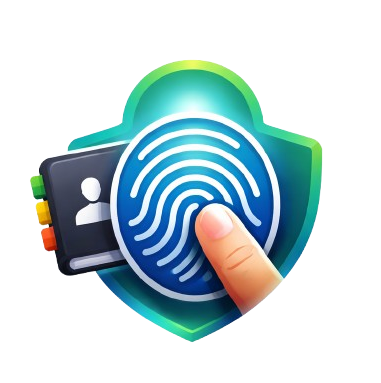
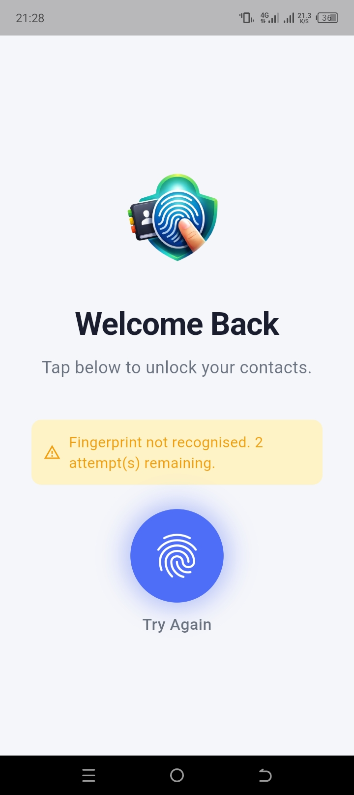
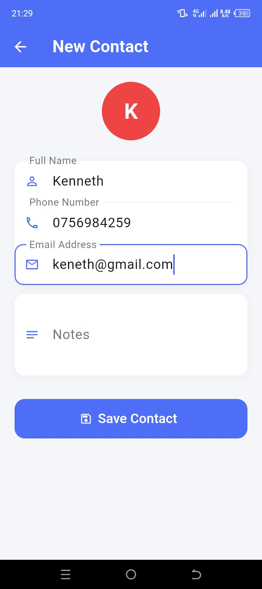
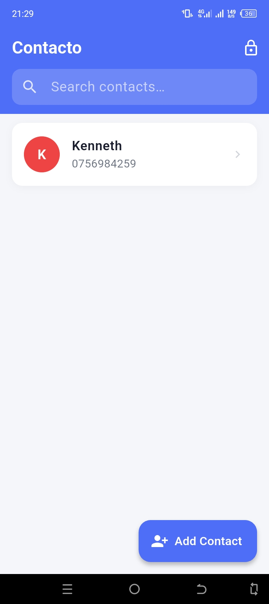

# Contacto 👆

> **Contacto** is a biometric-secured contact management app for Android. It replaces traditional password-based access with fingerprint authentication, ensuring your contact information stays private and easy to access — only by you.

---

<p align="center">
  
</p>

---

## 📋 Table of Contents

- [Overview](#overview)
- [Features](#features)
- [Tech Stack](#tech-stack)
- [Requirements](#requirements)
- [Getting Started](#getting-started)
- [Project Structure](#project-structure)
- [Security](#security)
- [Screenshots](#screenshots)
- [Contributing](#contributing)
- [License](#license)

---

## Overview

Traditional contact apps rely on passwords or PINs for security — methods that are easily forgotten, reused, or compromised. **Contacto** solves this by using your device's fingerprint sensor as the sole key to your contact vault.

Register once with your fingerprint, and every subsequent login is a single tap. No passwords. No PINs. Just you.

---

## Features

### 🔐 Authentication
- **Fingerprint Registration** — New users scan their fingerprint during a one-time setup to create a secure biometric profile.
- **Fingerprint Login** — Returning users authenticate by placing their finger on the sensor. Access is granted only on a successful match.
- **No Password Fallback** — The system is designed around biometric-only access, removing the weak link of text-based credentials.

### 👤 Contact Management
- **Add Contacts** — Enter and save contact details (name, phone number, email, etc.) securely linked to the authenticated user.
- **View Contacts** — Browse the full list of stored contacts after successful fingerprint authentication.
- **Edit Contacts** — Update existing contact information at any time.
- **Delete Contacts** — Remove contacts permanently from the local database.
- **Search Contacts** — Quickly locate a contact by name or number using the built-in search.

### 🛡️ Security
- **Biometric-Gated Access** — All contact data is locked behind fingerprint verification. Unauthorized users cannot view or interact with stored contacts.
- **Local Storage** — All data is stored on-device using SQLite. No data is transmitted to external servers.
- **Session Protection** — The app re-authenticates the user on relaunch, preventing access if the device is left unattended.

### ⚙️ General
- **Lightweight & Offline** — Fully functional without an internet connection.
- **Android 6.0+ Support** — Compatible with a broad range of Android devices that support the fingerprint sensor API.
- **Clean, Minimal UI** — Intuitive interface built with Flutter for a smooth native-like experience.

---

## Tech Stack

| Layer | Technology |
|---|---|
| Framework | Flutter / Dart |
| Database | SQLite (via `sqflite`) |
| Biometrics | `local_auth` plugin |
| IDE | Android Studio |
| Platform | Android 6.0 (API 23) and above |

---

## Requirements

- Flutter SDK `>=3.0.0`
- Dart `>=3.0.0`
- Android Studio (Arctic Fox or later recommended)
- Android device or emulator running **Android 6.0 (Marshmallow) or higher**
- Device must have a **registered fingerprint** in system settings

---

## Getting Started

### 1. Clone the repository

```bash
git clone https://github.com/your-username/contacto.git
cd contacto
```

### 2. Install dependencies

```bash
flutter pub get
```

### 3. Run the app

```bash
flutter run
```

> **Note:** To test fingerprint authentication, use a **physical Android device** with a fingerprint enrolled in device settings. Emulators have limited biometric support.

### 4. Build a release APK

```bash
flutter build apk --release
```

The APK will be output to `build/app/outputs/flutter-apk/app-release.apk`.

---

## Project Structure

```
contacto/
├── lib/
│   ├── main.dart                  # App entry point
│   ├── app/
│   │   └── app.dart               # App root widget & routing
│   ├── features/
│   │   ├── auth/                  # Fingerprint authentication screens & logic
│   │   ├── contacts/              # Contact list, add, edit, detail screens
│   │   └── onboarding/            # First-time registration flow
│   ├── data/
│   │   ├── database/              # SQLite setup & queries
│   │   └── models/                # Contact & user data models
│   └── shared/
│       ├── widgets/               # Reusable UI components
│       └── utils/                 # Helper functions
├── android/                       # Android-specific config
├── pubspec.yaml                   # Dependencies & metadata
└── README.md
```

---

## Security

Contacto is designed with a local-first, privacy-focused security model:

- **No cloud sync** — Contact data never leaves the device.
- **Biometric-only authentication** — The `local_auth` Flutter plugin interfaces with Android's `BiometricPrompt` API, ensuring fingerprint matching is handled entirely by the OS's secure enclave — Contacto never has access to raw fingerprint data.
- **SQLite encryption** — *(Planned)* Future versions will encrypt the local database at rest using SQLCipher.

---

## Screenshots

| Registration | Login | Contact List |
|:---:|:---:|:---:|
|  |  |  |

> 📸 To add screenshots: take them on your device with the power + volume-down buttons, copy them to `screenshots/` in the project root, and name them `register.png`, `login.png`, and `contacts.png`.

---

## Contributing

Contributions are welcome! To get started:

1. Fork the repository
2. Create a feature branch: `git checkout -b feature/your-feature-name`
3. Commit your changes: `git commit -m "Add: your feature description"`
4. Push to the branch: `git push origin feature/your-feature-name`
5. Open a Pull Request

Please follow the existing code style and ensure `flutter analyze` passes before submitting.

---

## License

This project is licensed under the [MIT License](LICENSE).

---

<p align="center">Built with ❤️ using Flutter</p>